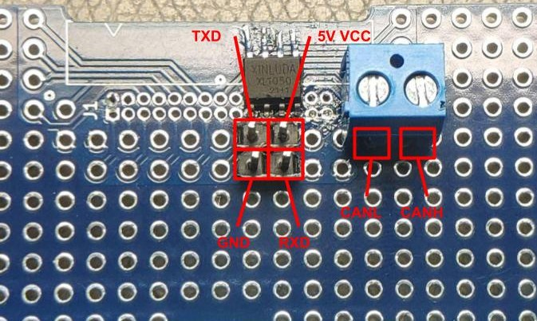

## USB to CAN controller

Implementation for STM32F407G Discovery together with CAN Transciever Xinluda XL1050 (custom breakout board).

### CAN Transciever custom breakout board

Breakout connections:  

- 120 Ohm resistor between CANH and CANL
- 100nF capacitor at VCC input
- Vref unconnected
- S connected to GND

Breakout pins:

### Credits

Inspiration from [USBtoCAN from Ben Katz](https://github.com/bgkatz/USBtoCAN)